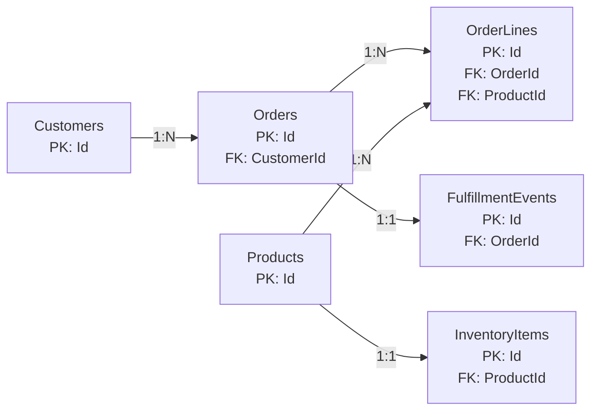

# BloomRush Relationship Schema

This diagram shows the relationships in the current BloomRush data model and the cardinality of each line.

## Reading the lines

- `Customers 1:N Orders`
  This means one customer can have many orders, and each order belongs to one customer.

- `Orders 1:N OrderLines`
  This means one order can contain many lines, and each line belongs to one order.

- `Products 1:N OrderLines`
  This means one product can appear in many lines, and each line references one product.

- `Products 1:1 InventoryItems`
  This means one product has one inventory row, and one inventory row belongs to one product.

- `Orders 1:1 FulfillmentEvents`
  This means the current fulfillment flow creates one final fulfillment event for one order.

## Derived many-to-many

- `Orders N:N Products`
  This relation is indirect and happens through `OrderLines`.
  One order can contain many products, and one product can appear in many orders.
